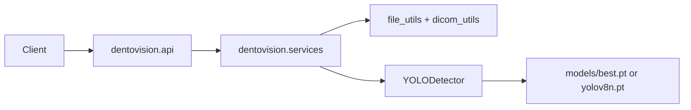

# Architecture

DENTOVISION is a layered Python package (`dentovision`) served by FastAPI. There is no frontend, database, or authentication layer in this prototype.

**Not a medical device. Not for clinical use.**

## Request flow



1. FastAPI lifespan loads `YOLODetector` into `app.state` once at startup.
2. `POST /predict` injects `PredictionService` with that detector.
3. `PredictionService` validates the upload, decodes PNG/JPEG or DICOM to a BGR NumPy array, then runs inference.
4. Findings are mapped to `FindingSchema` and returned as JSON.

`FileRepository` can persist uploads under `datasets/uploads` with a path-traversal guard. The current `/predict` path does not call it; files stay in memory.

## Package layout

| Package | Role |
| --- | --- |
| `dentovision.api` | FastAPI factory, CORS, exception handlers, `/health`, `/predict` |
| `dentovision.core` | `Settings` (pydantic-settings), rotating file logger, domain exceptions |
| `dentovision.services` | Orchestrates validation, decode, and detection |
| `dentovision.inference` | `BaseDetector` ABC, Ultralytics YOLO, optional box visualization |
| `dentovision.utils` | Size/extension/MIME checks and DICOM-to-NumPy conversion |
| `dentovision.repositories` | Local disk placeholder for future storage/S3 |
| `dentovision.training` | Train, evaluate, COCO-to-YOLO, split, stats, preprocess |

Non-Python assets stay at the repo root: `configs/data.yaml`, `models/`, `datasets/`, `logs/`.

## HTTP API

| Method | Path | Description |
| --- | --- | --- |
| `GET` | `/health` | `{ "status": "ok", "environment": "<ENVIRONMENT>" }` |
| `POST` | `/predict` | Multipart file upload; returns findings |

`POST /predict` response:

```json
{
  "findings": [
    {
      "class": "caries",
      "confidence": 0.91,
      "bbox": [x1, y1, x2, y2]
    }
  ]
}
```

Detection classes are defined in [`configs/data.yaml`](configs/data.yaml):

- `0`: `caries`
- `1`: `periapical_lesion`

OpenAPI/Swagger is served at `/docs`.

## Configuration

Settings load from environment variables and `.env` via `dentovision.core.config.Settings`. The model path field is `yolo_model_path` (`YOLO_MODEL_PATH`). If that file is missing, `YOLODetector` loads `yolov8n.pt` from the process working directory.

See [`.env.example`](.env.example) and [docs/getting-started.md](docs/getting-started.md).

## Runtime notes

- CORS is currently `allow_origins=["*"]` with credentials enabled. There is no authentication.
- Upload hardening: max size, extension allowlist, MIME sniffing (`python-magic`).
- Visualization (`inference.visualize.draw_predictions`) is not wired into the API response.
- Docker runs as non-root `appuser` and starts `uvicorn dentovision.api.app:app`.

## Training pipeline

Training is separate from the API process:

```bash
python -m dentovision.training.train --data configs/data.yaml --weights yolov8n.pt
python -m dentovision.training.evaluate --weights models/best.pt --data configs/data.yaml
```

`configs/data.yaml` points at `../datasets` with `images/train` and `images/val`. Details are in [docs/training.md](docs/training.md).
